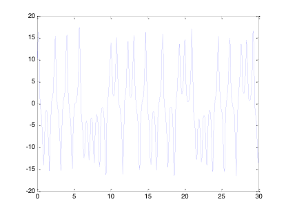
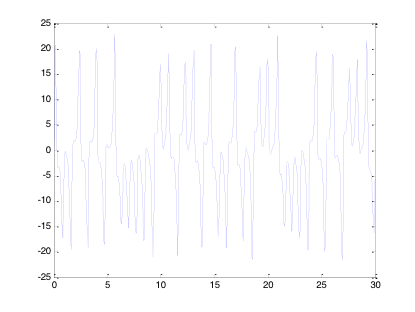
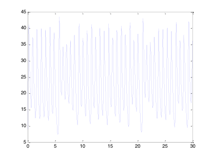
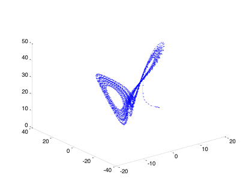
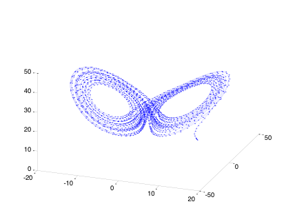
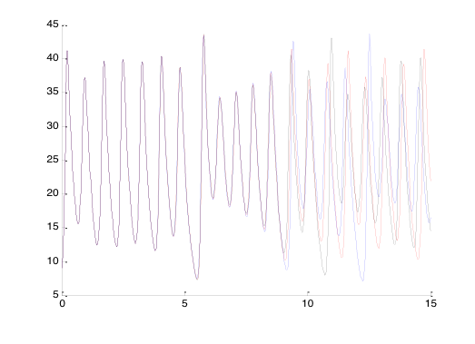

洛伦兹方程的求解

 

洛伦兹吸引子是混沌理论重要的标志，而它是由洛伦兹方程求解得来的。

 

洛伦兹方程是一组常微分方程，而Runge-Kutta方法是求解常微分方程的经典方法，Matlab提供了多个采用该方法的函数命令，比如ode23,ode45等等，采用ode45命令求解Lorenz在研究大气对流模型时得到的洛伦兹方程:

dx/dt=A*(-x+y)

dy/dt=B*x-y-x*z

dz/dt=x*y-C*z

 

经常引用的具体参数是 A=10,B=28,C=8/3   相空间维数为三。

为了用matlab求解，将x,y,z,表示为y(1)，y(2)，y(3)，即为列向量中的三个分量。

 

1 .建立自定义函数，在edit中建立“Lorenz.m”的M文件.程序如下：

 

function dy = Lorenz(~,y)

dy=zeros(3,1);

dy(1)=10*(-y(1)+y(2));

dy(2)=28*y(1)-y(2)-y(1)*y(3);

dy(3)=y(1)*y(2)-8*y(3)/3;

end

2.在edit中建立“Lzdis.m”的M文件，用来求解和绘图。程序如下：

 

[t,y]=ode45('Lorenz',[0,30],[12,2,9]);

figure(1)

plot(t,y(:,1))

figure(2)

plot(t,y(:,2))

figure(3)

plot(t,y(:,3))

figure(4)

plot3(y(:,1),y(:,2),y(:,3))

3.运行得到如下的结果：

Figure(1)是y(1) 即x 关于t 的变化关系图

 

Figure(2)是y(2) 即y 关于t 的变化关系图

 

Figure(3)是y(3) 即z 关于t 的变化关系图

 

Figure(4)为)X,y,z的空间关系图，由于角度问题，不太清楚，更改观察角度。

输入：
       view([20，32])

运行得到Lorenz方程在三维相空间中的轨迹图形：

 

 

 

 

 

4．验证“蝴蝶效应”

洛伦兹方程的解对初始值十分敏感，现对y的初始值稍加修改，将2改为2.01和1.99，让后求解z的数值解。用edit命令建立“lzsensi.m”的M文件，程序如下：

clf

hold

[t,u]=ode45('Lorenz',[0 15],[12,2,9]);

plot(t,u(:,3),'Color','r');

[t,v]=ode45('Lorenz',[0 15],[12,2.01,9]);

plot(t,v(:,3),'Color','b');

[t,w]=ode45('Lorenz',[0 15],[12,1.99,9]);

plot(t,w(:,3),'Color','k');

运行得到不同初始条件下的z 关于t的图形：

 

 

 

黑色线（k）表示初值条件为[12,1.99,9]时的z-t 图形

绿色线（b）表示初值条件为[12,2,9]时的z-t 图形

红色线（r）表示初值条件为[12,2.01,9]时的z-t图形

 

容易看出：随着时间的推移，三条曲线的吻合程度越来越差，差距越来越大，变化也越来越不明显，成为混沌状态。

 